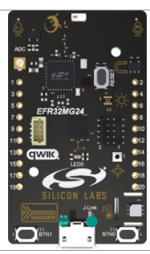
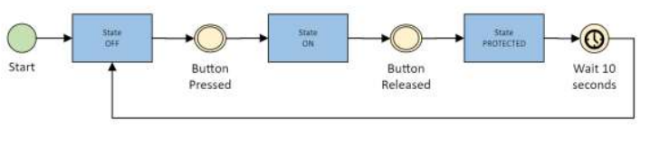
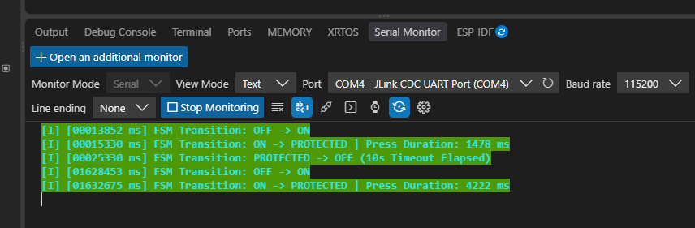
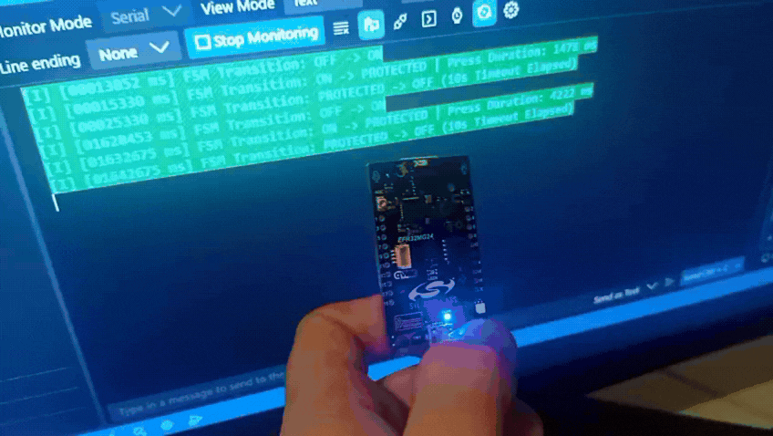

# Question 2 - Button State Machine on EFR32MG24

## What to Read

The core solution to Question 2 is implemented in these files:

- `main.c`: initializes the board and runs the main loop;
- `button_fsm.h`: declares the states, data structures, and public functions;
- `button_fsm.c`: implements button timing, debounce, state transitions, and LED control;
- `board_config.h`: defines the button and LED pins;
- `readme.md`: explains the solution and execution flow.

The folders `autogen/`, `config/`, `simplicity_sdk_2025.12.2/`, and `cmake_gcc/` are additional Silicon Labs platform files. They provide the libraries and generated configuration required to build and run the firmware on the EFR32 board.

## Solution

The original question requires only a microcontroller, a button, button-state detection, press-duration measurement, and the following state machine. The LED and serial output are optional additions used in this project for visual feedback and debugging; they are not required by the question.

The firmware is written in C and implements the required states:

- `OFF`: the button is released;
- `ON`: the button is pressed;
- `PROTECTED`: the button was released and the system waits 10 seconds before returning to `OFF`.

The firmware also measures how long the button remains pressed. The timing is non-blocking and uses the Silicon Labs Sleep Timer.

## Hardware

The target device is the **EFR32MG24B310F1536IM48**, configured with Simplicity Studio and the Silicon Labs Gecko SDK.

The project uses the following hardware. Only the button and microcontroller are required by the original question:

- the board push button on `PB2`;
- an external LED on `PD2` for visual debugging;
- VCOM/EUSART for debug logs only.

The button uses a pull-up input, so `0` means pressed and `1` means released. The LED is active-low, so `0` turns it on and `1` turns it off. The LED implementation can be removed without changing the state-machine behavior.



## State Machine

```text
BUTTON_STATE_OFF
        | button pressed
        v
BUTTON_STATE_ON
        | button released
        v
BUTTON_STATE_PROTECTED
        | 10 seconds elapsed
        v
BUTTON_STATE_OFF
```



In `BUTTON_STATE_OFF`, a debounced press stores the start time and changes to `BUTTON_STATE_ON`. In this implementation, the LED is also turned on as optional visual feedback.

In `BUTTON_STATE_ON`, the press duration is calculated as:

```c
current_time_ms - press_start_time_ms
```

When the button is released, the firmware stores the release time and changes to `BUTTON_STATE_PROTECTED`.

In `BUTTON_STATE_PROTECTED`, the firmware waits for 10 seconds. In this implementation, the LED remains on during this period. After the timeout, the firmware returns to `BUTTON_STATE_OFF` and turns off the LED.

## Debounce and Timer

Mechanical buttons can oscillate briefly when pressed or released. The software debounce filter accepts a new button state only after the signal remains stable for `50 ms`.

The Sleep Timer is initialized with:

```c
sl_sleeptimer_init();
```

The current tick count is converted to milliseconds with:

```c
sl_sleeptimer_tick_to_ms(sl_sleeptimer_get_tick_count());
```

No blocking `delay()` is used. The main loop continues reading the button and updating the FSM while the timers are running.

## Silicon Labs Support Files

These folders are included to make the project reproducible on the physical Silicon Labs board:

- `autogen/`: generated board, driver, VCOM, and component initialization sources;
- `config/`: peripheral and SDK configuration headers;
- `simplicity_sdk_2025.12.2/`: Silicon Labs device headers, drivers, middleware, and hardware abstraction layers;
- `cmake_gcc/`: CMake files used to compile and link the EFR32MG24 firmware.

They are additional platform libraries and configuration, not the main state-machine answer. Files under `autogen/` are generated by Simplicity Studio and should not be edited manually.

## Debug Logs

`app_log_info()` and `app_log_error()` are used only to observe startup, state transitions, press duration, and timeout completion through VCOM/EUSART. The serial configuration is `115200 8N1` with no flow control.

### Serial Monitor Output

The following capture shows the firmware running on the EFR32 board. It demonstrates the `OFF -> ON`, `ON -> PROTECTED`, and `PROTECTED -> OFF` transitions, including the measured button press duration and the 10-second protection timeout.



### Complete Hardware Demonstration

The following animation can show the complete debug demonstration: pressing the MCU button, the state transition in the serial monitor, and the LED response. The LED and serial output are optional debug aids; the required behavior is the button state machine and its timing.



## Documentation

The public functions are documented with Doxygen-style comments directly in the source and header files, using tags such as `@brief`, `@param`, and `@return`.

To generate HTML documentation locally, create a Doxyfile with:

```powershell
doxygen -g Doxyfile
```

Then configure the input files and generate the documentation with:

```powershell
doxygen Doxyfile
```

The generated documentation is available at:

```text
docs/html/index.html
```

The `Doxyfile` is intentionally not included in this repository. It is only a local configuration file used to generate the optional documentation.

## Build

Build the firmware with:

```powershell
cmake --build cmake_gcc/build
```

The resulting firmware can be programmed to the EFR32 board using Simplicity Studio.
